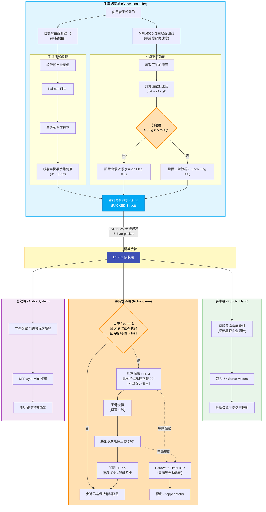

# CarCourse_group4

## Results

Finger movements:
Robotic finger bends according to the flex sensors on the glove.

Punch:
Robotic arm ejects when the sensor glove's acceleration exceeds 1.5g.

Demo Video:
https://www.youtube.com/watch?v=hl6YXo5eNV0

## Project structure:

